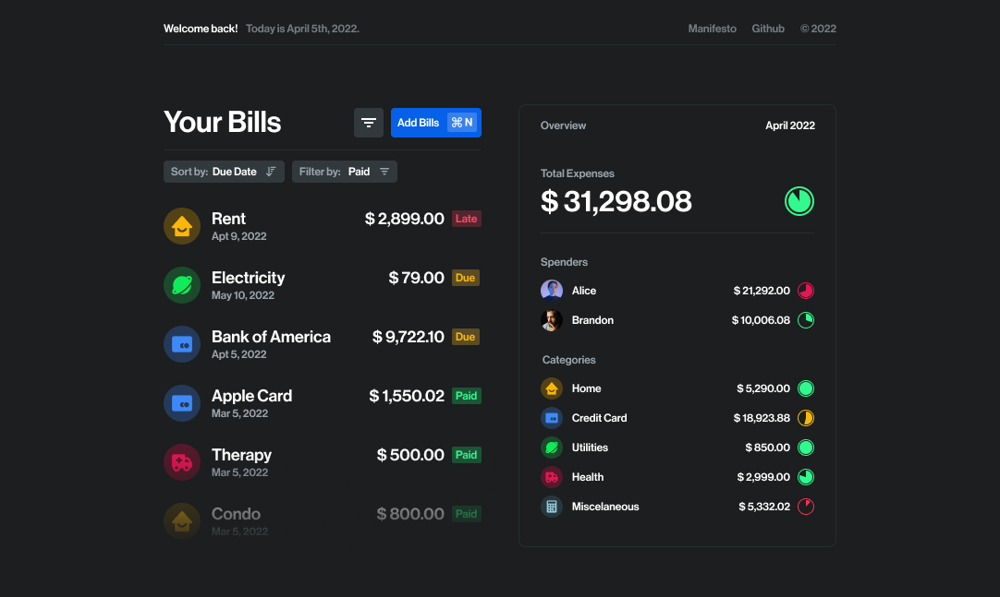

<h1 align="center">🏡 Home Bills</h1>

<p align="center">Minimalistic bill tracker for those who despise tracking microtransactions.</p>

<div align="center">
    
[](https://github.com/pixelsbyeryc/home-bills)
[](https://github.com/pixelsbyeryc/home-bills)
[](https://etherscan.io/address/0x750889c704857f766420b14723Ecb8320EB8E9ab)



[](https://app.netlify.com/sites/homebills/deploys)
    
</div>

<br>


## :trophy: Goals & Milestones

### Goals

01. 🔍 **Track important data.**
    Tracking microtransactions is extremely time consuming, especially when you have a lot of them spread out across multiple credit cards. 

02. 🔐 **Keep your data local and private.**
    Why should you have to worry about privacy policies that you're never gonna read? Who knows what these crazy people are doing with your data. 

03. 📊 **Useful reports.**
    Here's the thing: I want to know how much my household owes these credit card companies. And I want it in a nice UI — not some table-like, hard-to-use five-clicks-to-add-a-single-transaction app. 

04. ⚡️ **Shortcuts and hotkeys.**
    Come on, you're a developer. Why should you click on your finance app to do things? Let's make tracking finances easier with quick keystrokes.

### Milestones

**01. The Minimum Viable Code.**

- [x] Design a friendly and minimal interface.
- [x] Code interface for desktop.
- [x] Code the entire interface reponsively.
- [ ] [Add empty states #13](https://github.com/pixelsbyeryc/home-bills/issues/13)
    - [ ] Transaction List empty state 
    - [ ] Overview empty states
- [x] Open "Add Bills" pop-up.
    - [x] Add "Control + N" hotkey to add new bills.
    - [x] Add "Escape" hotkey to close bills modal.
- [ ] Data handling with localStorage (MVP).
    - [x] Add Bills: to transaction list and localStorage
    - [x] Remove Bill
    - [x] Toggle Paid
    - [ ] [Edit Bill Values #14](https://github.com/pixelsbyeryc/home-bills/issues/14)
- [ ] Generate overview reports with JS.
    - [ ] [Calculate data #9](https://github.com/pixelsbyeryc/home-bills/issues/9)
    - [ ] [Render Overview Data #10](https://github.com/pixelsbyeryc/home-bills/issues/10)
- [x] Open Source it: add a license, make repo public, and document.

**02. Better Data Management**

- [ ] Handle data with a local JSON file that you can store and sync with your iCloud, or GDrive.
- [ ] Ability to visualize your bills from your computer, phone, or tablet.

**03. Mobile App: I can see...**

- [ ] iOS App (read-only).
- [ ] iOS Widgets for previewing data on the Home Page.

**04. Mobile App: Permission to edit.**

- [ ] iOS App: manage your data on the app

<br>

## :runner: Run the project on your machine (or deploy it somewhere only you know :beach_umbrella:)

### 01. First Install all dependencies by running:

```
yarn
```
_Or `npm install` if you're not into the amazingness of yarn. :eyes:_

### 02. If you want to develop and make changes to it:

```
yarn dev
```
_Or `npm run dev`... Whatever. :roll_eyes:_


### 03. If you want to deploy it yourself, the build command is:

```
yarn build
```
_Or, **again**, `npm run build`. Gosh, you're weird._
